<div align="center">

# 木铎 MUDUO · 人类传播与社群增长引擎

### Human Communication & Community Growth Engine

> 「天下之无道也久矣，天将以夫子为木铎。」——《论语·八佾》
> 金口木舌，质直动人：不以金声炫技，以证据与机制服人。

**一套证据感知型的传播方法论 Skill——让 AI Agent 学会诊断"为什么传播 / 为什么不传播"，
而不是背诵爆款技巧。**

**An evidence-aware communication methodology skill that teaches AI agents to diagnose
why content spreads (or doesn't) — with mechanism, evidence grade, and applicability
boundary behind every recommendation.**

[](muduo/CHANGELOG.md)
[](muduo/knowledge/mechanisms)
[](muduo/platforms)
[](#评测)
[](#license)
[](https://skill.mizzlelover.xyz)

**由「谁是专家」研究并构建 · Built by [谁是专家](#作者--关于谁是专家)**
小红书 **[谁是专家](https://www.xiaohongshu.com/user/profile/64dd6c680000000001011d25)**（小红书号 9945310245）· 微信公众号 **谁是专家** · X (Twitter) [@dboy_yi2025](https://x.com/dboy_yi2025)

[中文](#中文) · [English](#english) · [完整文档](#文档地图)

🌐 **在线展示 Live：[skill.mizzlelover.xyz](https://skill.mizzlelover.xyz)**

</div>

---

## 网站预览 · Landing Preview

> 独立宣传站「**木铎 MUDUO**」已部署于 [skill.mizzlelover.xyz](https://skill.mizzlelover.xyz)——「天下之无道也久矣，天将以夫子为木铎」（《论语·八佾》）。宣纸、墨字、朱砂印、青铜金口的新中式设计，包含可交互的**机制星图**（下方第 3 张图的实时知识子图：悬停查看机制的中英文名、证据等级与全图引用度，可拖拽、可按族群筛选）。

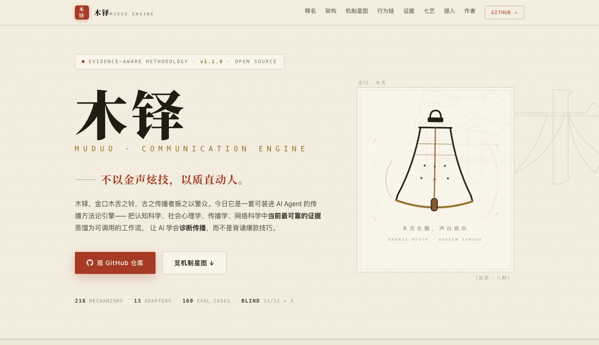
*首屏：木铎线图与「不以金声炫技，以质直动人」 · Hero: the wooden-tongue bell line art*

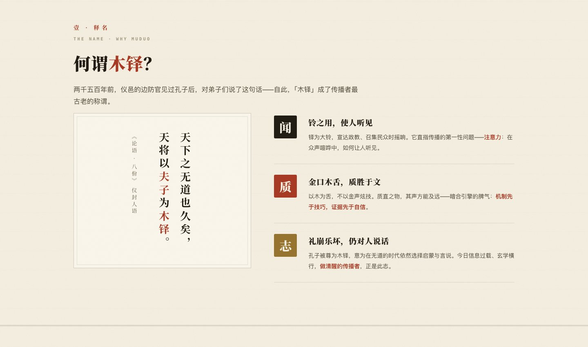
*释名：《论语》竖排碑版与「闻 / 质 / 志」三层品牌释义 · The name: vertical Analects stele and the three-layer story*

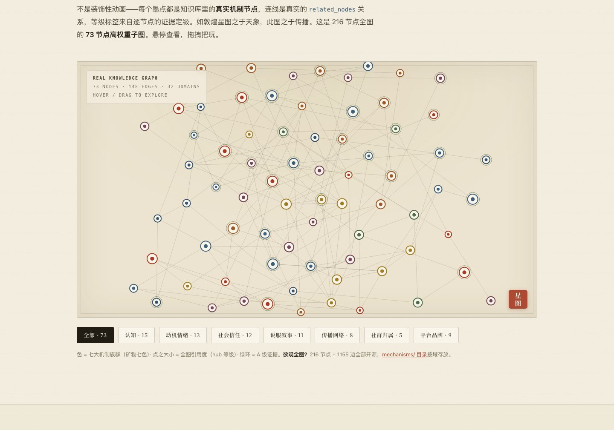

<details>
<summary><b>更多截图 · More screenshots</b>（点击展开 / click to expand）</summary>

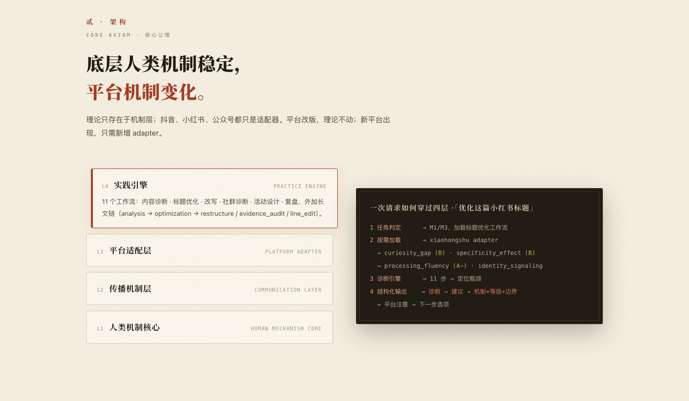
*四层架构与一次诊断请求的完整数据流 · The 4-layer architecture and the data flow of one diagnosis request*

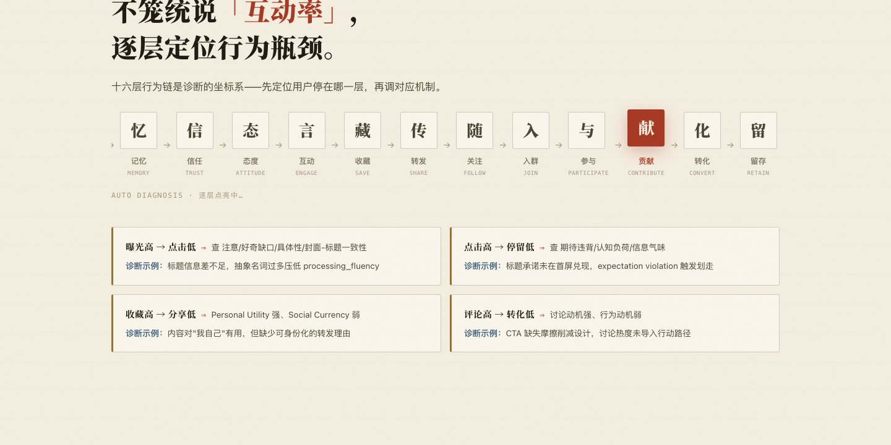
*十六层传播行为链与漏斗诊断示例 · The 16-layer behavior chain with funnel diagnosis examples*

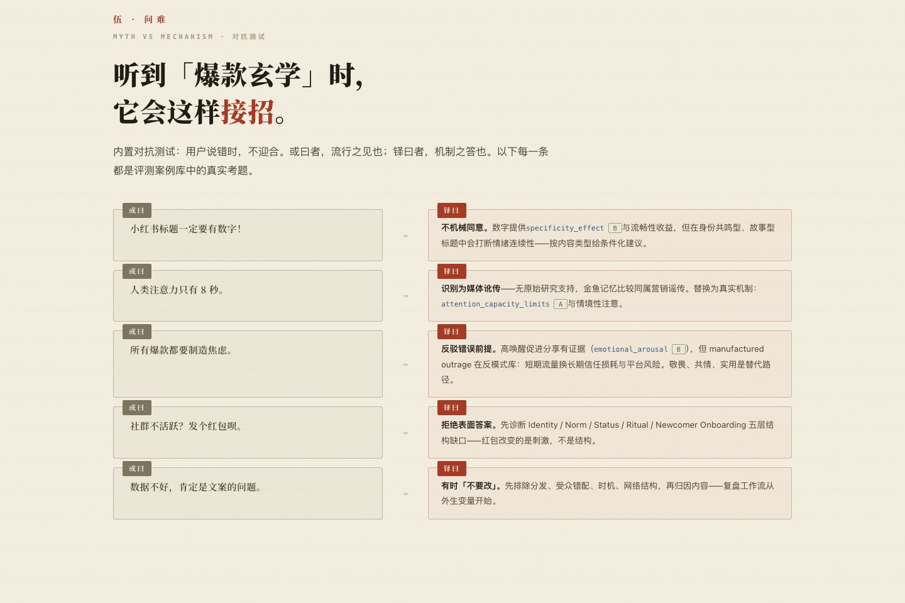
*问难 · 语录体对抗测试：「或曰」爆款玄学，「铎曰」机制回答 · Adversarial tests in classic dialogue form*

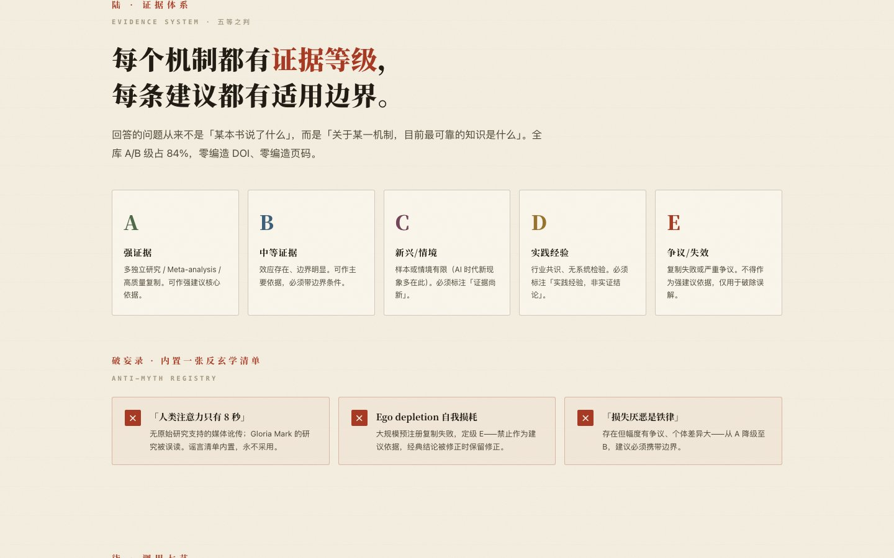
*证据等级 A–E 与内置反玄学清单 · Evidence grades A–E and the built-in anti-myth list*

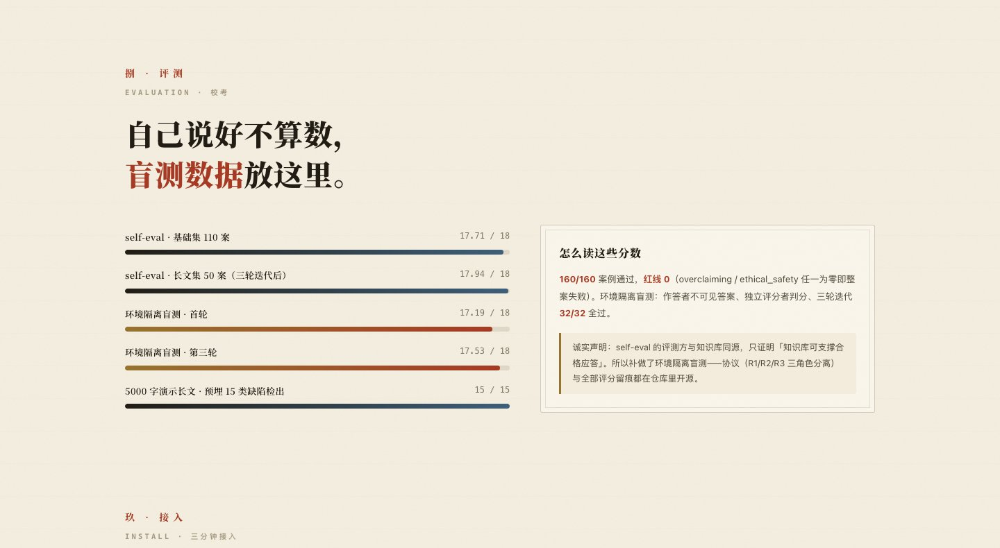
*208 评测案例与多轮环境隔离盲测 · 208 evaluation cases and multiple rounds of isolated blind tests*

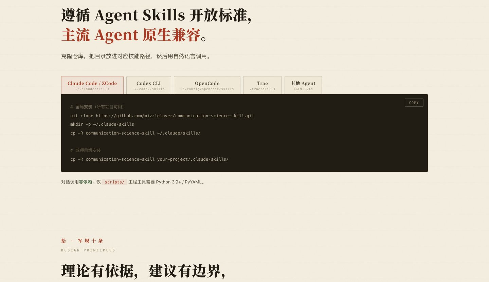
*Claude Code / Codex / OpenCode / Trae 五种接入方式 · Five installation paths for mainstream agents*

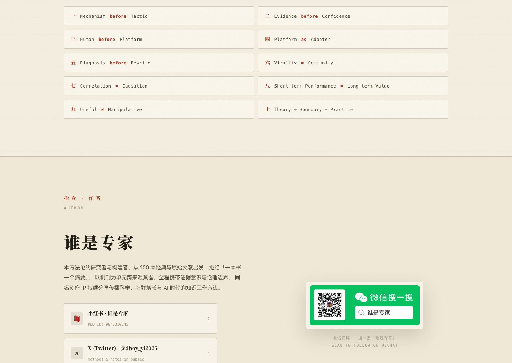
*作者「谁是专家」与全平台入口 · The author and platform links*

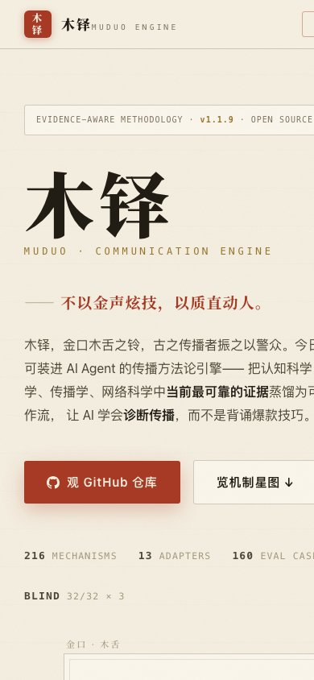
*移动端适配 · Mobile-responsive*

</details>

---

# 中文

## 为什么做这个

关于"内容为什么火"，市面上主要有两种回答：

1. **爆款玄学**——"标题要加数字""前 3 秒必须有冲突""小红书一定要 XX 字"。技巧清单满天飞，但没人告诉你它为什么有效、对谁有效、什么时候会失效。
2. **心理学名词堆砌**——把一百个"心理效应"当真理用，不问效应量，不问复制危机，不问边界条件。

本项目走第三条路：**把认知科学、社会心理学、传播学、网络科学、说服科学与平台机制研究中"当前最可靠的证据"，蒸馏成一套 AI Agent 可直接调用的方法论。**

它基于一条核心公理：

> **底层人类机制稳定，平台机制变化。**
> 理论只存在于机制层（Human Mechanism Core）；抖音、小红书、公众号都只是适配器（Platform Adapter）。
> 平台规则改版，不影响理论；新平台出现，只需新增 adapter。

## 它能做什么

| 模式 | 你可以对 Agent 说 | 触发的工作流 |
|---|---|---|
| M1 快速诊断 | "帮我看看这个标题行不行" | 内容诊断（快速档） |
| M2 深度分析 | "机制级分析：为什么这篇传播不动" | 内容诊断（深档） |
| M3 改写 | "直接改写 / 给我几个新标题" | 标题优化 / 内容改写 |
| M4 研究 | "研究一下 XX 传播现象" | 知识库检索 + 理论冲突记录 |
| M5 社群策略 | "付费社群 800 人只有 20 人说话，怎么救" | 社群诊断 / 活动设计 |
| M6 复盘 | "曝光 20 万、点击 3%、完播 2%，复盘一下" | 传播复盘（先排除外生变量） |
| M7 长文 | "优化这篇 5000 字文章" | 长文分析 → 重构 → 证据审计 → 逐句编辑 |

覆盖的能力：

- **传播诊断**——标题/首屏/结构/叙事/证据/情绪/CTA/标签逐要素拆解，定位 16 层行为链（注意 → 点击 → 阅读 → 理解 → 记忆 → 信任 → 互动 → 收藏 → 转发 → 关注 → 入群 → 转化 → 留存）中的最短板
- **长文深度优化（Long-form Intelligence）**——3000 字以上文章的中心命题抽取、论证地图、读者五阶段旅程、认知负荷曲线、语义重复压缩、证据审计、结构重排；支持公众号深度文、行业研究、咨询报告、AI 生成长文的检测，超长文自动分块
- **社群诊断与设计**——Identity / Boundary / Norm / Status / Ritual / Newcomer Onboarding 等 10 层结构，回答"社群为什么沉寂"
- **传播复盘**——从漏斗相邻比率定位环节，而不是把所有问题归罪于文案（有时"不要改"才是正确答案）
- **平台适配**——13 个平台适配器（公众号 / 小红书 / 抖音 / 视频号 / B 站 / 知乎 / 微博 / X / TikTok / YouTube / 朋友圈 / 微信群 / generic）
- **每条建议三件套**——机制依据 + Evidence Grade（A–E）+ 适用边界

## 和"爆款秘籍"有什么区别

| 常见做法 | 本 Skill 的做法 |
|---|---|
| "标题要加数字" | 说机制：数字提供 specificity_effect（B）与 processing_fluency；但身份共鸣型/故事型标题中可能削弱情绪连续性——按内容类型给条件化建议 |
| "研究表明……" | 引用的每个机制必须带证据等级；无法核实出处的断言不入库；全库零编造 DOI/页码/效应量 |
| 把营销经验包装成科学规律 | 经验一律标 D 级"实践经验，非实证结论"；E 级（复制失败）不得作为强建议依据 |
| "人类注意力只有 8 秒" | 识别为媒体讹传（谣言清单内置），替换为 attention_capacity_limits 的真实机制 |
| 平台规则写进方法论 | 平台事实四级标注（official_rule / verified_observation / industry_consensus / experience_speculation）+ last_updated，与理论层物理隔离 |
| 数据不好 = 文案不好 | 先排除分发、受众错配、时机、网络结构，再归因内容 |
| 流量 = 社群 | 六个目标严格区分：Reach / Virality / Engagement / Community / Conversion / Retention |
| 刷量、编造好评、制造虚假稀缺 | 反模式库明令拒绝：说明为什么短期有效、为什么长期损害信任与账号 |

## 工作原理

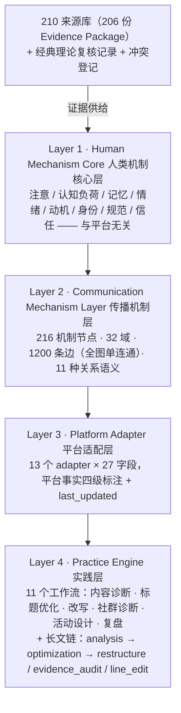

一次请求如何穿过四层（以"优化这篇小红书标题"为例）：

```text
1. 任务判定 → M1/M3，加载标题优化工作流
2. 按需加载（progressive disclosure，禁止全库加载）：
   平台 adapter（xiaohongshu）→ 相关机制节点（curiosity_gap / specificity_effect /
   processing_fluency / identity_signaling…）→ 每个节点的证据等级与边界
3. 诊断引擎 11 步 → 定位瓶颈 → 按 Recommendation Schema 输出
4. 输出格式：传播诊断 → 核心问题 → 为什么 → 修改建议 → 示例 → 平台注意事项 → 下一步选项
```

## 输出长什么样

格式示例（演示数据）——一条合格建议必须携带机制、等级与边界：

> **传播诊断**：这条视频曝光 20 万、完播率 2%，瓶颈大概率不在标题，在首屏。
> **核心问题**：标题承诺与开头内容错位（expectation violation），用户 3 秒内离开。
> **为什么**：点击动机来自标题制造的信息差，但前 3 秒没有接住这条信息差，反而从背景讲起。
> **修改建议**：首屏直接回应标题承诺，把背景信息后移至第 2 个信息单元之后。
> **机制依据**：期待违背（Expectation Violation）（B）——适用于强承诺型标题；叙事型内容慎用。
> **平台注意事项**：抖音完播与划走速度是强排序信号（industry_consensus，以平台最新公告为准）。
> **下一步选项**：只改首屏 / 重写脚本结构 / 保持现状先测一版新标题

同时它会说"不"：拒绝刷量与编造好评、反驳"所有爆款都要制造焦虑"、拒绝把 ego depletion 这类复制失败的理论当依据、社群没人说话时不只会建议"发红包"。

## 证据体系

每个机制节点标注 **Evidence Grade**，建议输出必须同时携带等级与适用边界：

| 等级 | 含义 | 使用规则 |
|---|---|---|
| A | 强证据：多独立研究 / Meta-analysis / 高质量复制 | 可作强建议核心依据 |
| B | 中等证据：效应存在但边界明显 | 可作主要依据，必须带边界条件 |
| C | 新兴/情境依赖：样本或情境有限（多为 AI 时代新现象） | 必须明示"证据尚新" |
| D | 从业者经验：无系统科学检验 | 必须标注"实践经验，非实证结论" |
| E | 有争议/复制失败 | 不得作为强建议依据 |

复制危机敏感清单内置（示例）：ego depletion（E）、行为层语义启动（E）、power posing（E）、
loss aversion（降级至 B）、nudge 平均效应（C）、choice overload（条件化）、
"人类注意力只有 8 秒"与"金鱼注意力"（媒体讹传，不采用）。

当前分布：A/B 级 **82%**（177/216 节点）；C 级 30 个集中于 AI 信息环境模块并如实标注"研究快速发展中"。

## 快速开始

```bash
git clone https://github.com/mizzlelover/muduo.git
```

本 Skill 遵循 **Agent Skills 开放标准**（`SKILL.md` 入口），主流编码 Agent 原生兼容，
把 `muduo/` 目录放入对应技能目录即可：

| 环境 | 全局安装（用户级，所有项目可用） | 项目级安装 |
|---|---|---|
| Claude Code / ZCode | `~/.claude/skills/`（跨 Agent 共享目录 `~/.agents/skills/` 亦可） | `.claude/skills/` |
| Codex CLI | `~/.codex/skills/` | `.codex/skills/` |
| OpenCode | `~/.config/opencode/skills/` | `.opencode/skills/` |
| Trae | — | `.trae/skills/` |

```bash
# 示例：三大环境一次性全局安装
cp -R muduo ~/.claude/skills/
cp -R muduo ~/.codex/skills/
mkdir -p ~/.config/opencode/skills && cp -R muduo ~/.config/opencode/skills/
```

安装后在任意环境中用自然语言调用即可（Codex 中也可用 `$muduo` 显式唤起）。

**其他 Agent 的兜底方式**：任何遵循 Agent Skills 标准的环境都可直接引用本目录；
仅识别 `AGENTS.md` 的 Agent，在项目的 `AGENTS.md` 中加一行即可生效：

```markdown
处理传播诊断/内容优化/社群增长/长文优化/传播复盘类任务时，
先阅读 muduo/SKILL.md 并严格遵循其工作流与铁律。
```

依赖：Python 3.9+ / PyYAML（仅运行 `scripts/` 工程工具时需要；对话使用零依赖）。

安装后直接用自然语言调用：

```text
帮我看看这篇小红书标题为什么没人点
机制级分析：这篇公众号文章为什么没人转发
我们的付费社群 800 人只有 20 人说话，怎么救
优化这篇 6000 字行业研究（长文模式）
复盘：曝光 50 万、点击 4%、收藏 8%、转发 0.3%，问题在哪
```

## 评测

诚实声明先行：**self-eval 的评测执行方与被测知识库同源**，只能证明"知识库可支撑合格应答"，
存在后见之明天花板；因此补做了环境隔离盲测，并公开协议与全部评分留痕。

| 评测 | 规模 | 结果 |
|---|---|---|
| self-eval | 160 案例（110 基础 + 50 长文） | 160/160 通过，红线 0；基础集均值 17.71/18，长文集 17.94/18 |
| 环境隔离盲测 | 32 案分层抽样 ×3 轮 + E2 专项 48 案（作答不可见答案 · 独立评分 · 审计抽查） | 全部通过、红线 0 |
| 长文实跑验证 | 5000 字演示文章，预埋 15 类缺陷 | 15/15 全部命中 |

评分维度：9 维 × 0–2 分 + 双红线（overclaiming / ethical_safety 任一 0 分即整案失败）。
已知局限：盲测存在训练性同源（彻底解法为外部独立模型执行）、全量 208 案的外部独立
盲测未跑（协议已就绪：`evals/blind_protocol.md`）——详见 [EVALS.md](muduo/EVALS.md)。

## 项目结构

```text
muduo/
├── SKILL.md            # Agent 入口：任务判定 + progressive disclosure 检索策略 + 11 条铁律
├── knowledge/          # 216 机制节点（32 域）· 210 来源（206 份 Evidence Package）· 冲突登记 · 经典复核 · 案例 · 反模式
├── platforms/          # 13 个平台适配器（27 必填字段 + 事实四级标注 + last_updated）
├── workflows/          # 11 个工作流（6 基础 + 5 长文）
├── schemas/            # 8 个数据 Schema（机制节点 / 来源 / 案例 / 平台 adapter / 长文…）
├── evals/              # 208 评测案例 + rubric + 盲测协议与评分留痕
├── scripts/            # 13 个自动化工具
└── ARCHITECTURE.md · METHODOLOGY.md · EVIDENCE.md · PLATFORM_ADAPTER.md · EVALS.md
    · CONTRIBUTING.md · INDEX.md
```

| 组件 | 数量 |
|---|---|
| 机制节点 | 216（32 域，每节点 20+ 字段：定义/机制/因果链/变量/证据四栏/边界/失效条件/伦理风险） |
| 机制图 | 1200 条边 · 全图单连通 · 平均度 11.1 |
| 来源 | 210 全入库（206 份活跃 Evidence Package + 4 份合并墓碑），100% 被节点引用 |
| 平台适配器 | 13 × 27 字段 · 291 条平台事实（official_rule 46 / verified 9 / consensus 233 / speculation 3） |
| 反模式 | 29（10 通用 + 19 长文/AI 写作，均含"为何短期有效 / 为何长期受损"） |
| 评测 | 208 案例（易 45 / 中 104 / 难 59，含对抗测试、E2 专项与回归集） |

### 工程工具

```bash
cd muduo/scripts
python3 validate_schema.py          # 全库结构与引用校验
python3 detect_duplicate_nodes.py   # 机制节点查重
python3 detect_uncited_claims.py    # 无出处断言检测
python3 build_graph.py              # 重建机制图并输出连通性统计
python3 build_index.py              # 生成 INDEX.md
python3 run_evals.py                # 评测汇总
```

## 路线图

- [ ] 外部独立模型执行全量 208 案第三方盲测（协议已就绪：`evals/blind_protocol.md`）
- [ ] 平台 adapter 联网复核与自动更新机制（`update_platform_knowledge`）
- [ ] C 级节点证据升级：AI 信息环境模块的 meta-analysis 检索
- [ ] 受众理论节点化（uses_and_gratifications）、中文语境本土实证检索
- [ ] 高频场景（标题诊断 / 社群诊断）端到端 few-shot 演示

## 文档地图

| 文档 | 内容 |
|---|---|
| [SKILL.md](muduo/SKILL.md) | Agent 入口与全部行为铁律 |
| [ARCHITECTURE.md](muduo/ARCHITECTURE.md) | 四层架构与数据流 |
| [METHODOLOGY.md](muduo/METHODOLOGY.md) | 证据感知型知识蒸馏方法 |
| [EVIDENCE.md](muduo/EVIDENCE.md) | A–E 证据体系与经典复核清单 |
| [PLATFORM_ADAPTER.md](muduo/PLATFORM_ADAPTER.md) | 平台事实规范 |
| [EVALS.md](muduo/EVALS.md) | 评测方法与 9 维 rubric |
| [CONTRIBUTING.md](muduo/CONTRIBUTING.md) | 如何新增机制/平台/案例 |
| [CHANGELOG.md](muduo/CHANGELOG.md) | 版本记录（core / platform / evidence 三线） |
| [INDEX.md](muduo/INDEX.md) | 全库索引（自动生成） |

## 作者 · 关于「谁是专家」

本方法论由 **谁是专家** 研究、构建与维护——
从 100 本经典与原始文献出发，拒绝"一本书一个摘要"，以机制为单元跨来源蒸馏，
全程携带证据意识与伦理边界。

同名创作 IP 活跃于以下平台，持续分享传播科学、社群增长与 AI 时代的知识工作方法：

- **小红书**：[谁是专家](https://www.xiaohongshu.com/user/profile/64dd6c680000000001011d25)（小红书号：**9945310245**）
- **微信公众号**：谁是专家 —— 微信搜一搜「谁是专家」，或扫描下方二维码
- **X (Twitter)**：[@dboy_yi2025](https://x.com/dboy_yi2025)

<div align="center">
  
  <p><sub>微信扫码 / 搜一搜「谁是专家」· Scan to follow on WeChat</sub></p>
</div>

## 引用

如果你在研究或写作中使用了本项目，欢迎引用：

```bibtex
@software{muduo,
  title  = {人类传播与社群增长引擎 (Human Communication \& Community Growth Engine)},
  author = {谁是专家},
  year   = {2026},
  url    = {https://github.com/mizzlelover/muduo},
  note   = {v1.0 · 216 mechanism nodes · evidence-aware communication methodology skill}
}
```

## License

- **代码**（`scripts/` 内 Python 工具）：[MIT](LICENSE)
- **知识库与方法论文档**（knowledge / platforms / workflows / evals / 各 .md）：
  [CC BY 4.0](https://creativecommons.org/licenses/by/4.0/deed.zh)——转载与衍生请署名「谁是专家」并链接本仓库

---

# English

## Why this exists

Ask "why did this content blow up?" and you'll mostly get two kinds of answers:

1. **Viral folklore** — "put numbers in the title", "conflict in the first 3 seconds", "Xiaohongshu posts must be N words". Endless tactic lists, but no one tells you *why* a tactic works, *for whom*, or *when it stops working*.
2. **Psychology-term soup** — a hundred "psychological effects" used as laws of nature, ignoring effect sizes, the replication crisis, and boundary conditions.

This project takes a third path: **distill the current best evidence from cognitive science,
social psychology, communication theory, network science, persuasion research, and platform
studies into a methodology that AI agents can actually invoke.**

It rests on one core axiom:

> **Human mechanisms are stable; platforms change.**
> Theory lives only in the Human Mechanism Core. Douyin, Xiaohongshu, WeChat — they are all
> just Platform Adapters. When a platform redesigns its feed, the theory doesn't move;
> you add an adapter.

## What it does

| Mode | You say | Workflow |
|---|---|---|
| M1 Quick diagnosis | "Is this title any good?" | Content analysis (quick) |
| M2 Deep analysis | "Mechanism-level: why doesn't this spread?" | Content analysis (deep) |
| M3 Rewrite | "Rewrite it / give me title options" | Title optimization / content rewrite |
| M4 Research | "Research this spreading phenomenon" | Knowledge retrieval + conflict registry |
| M5 Community | "Our paid community has 800 members and 20 talk. Fix it." | Community diagnosis / campaign design |
| M6 Postmortem | "200K impressions, 3% CTR, 2% completion — diagnose it" | Postmortem (exogenous variables first) |
| M7 Long-form | "Optimize this 5,000-word article" | Long-form analysis → optimization → evidence audit → line edit |

Capabilities:

- **Communication diagnosis** — element-by-element teardown (title / cover / hook / structure /
  narrative / evidence / emotion / CTA / tags) that locates the weakest link along a 16-layer
  behavior chain: attention → click → read → comprehend → remember → trust → engage → save →
  share → follow → join → participate → contribute → convert → retain.
- **Long-form Intelligence** — for articles ≥ 3,000 characters: central thesis extraction,
  argument mapping, a five-stage reader journey, cognitive load curve, semantic redundancy
  compression, evidence audit, structural re-planning (structure first, then line editing);
  detects AI-generated prose patterns and handles over-long texts via chunked protocol.
- **Community diagnosis & design** — a 10-layer structural model (Identity / Boundary / Norm /
  Status / Ritual / Newcomer Onboarding …) that explains *why* a community went quiet.
- **Postmortem** — locates the broken funnel step from adjacent ratios instead of blaming the
  copy; sometimes the right answer is "don't change the content".
- **Platform adaptation** — 13 adapters (WeChat Official / Xiaohongshu / Douyin / WeChat
  Channels / Bilibili / Zhihu / Weibo / X / TikTok / YouTube / Moments / WeChat groups / generic).
- **Every recommendation ships with** — mechanism + Evidence Grade (A–E) + applicability boundary.

## How it differs from "viral hacks"

| Common practice | This skill |
|---|---|
| "Titles need numbers" | States the mechanism: numbers provide specificity_effect (B) and processing_fluency; but in identity-resonance or story-type titles they can break emotional continuity — conditional advice by content type |
| "Research shows…" | Every cited mechanism carries a grade; unverifiable claims never enter the library; zero fabricated DOIs / page numbers / effect sizes |
| Marketing folklore dressed as science | Practitioner heuristics are graded D ("experience, not empirical findings"); E-grade (failed replications) may never back a strong recommendation |
| "Humans have an 8-second attention span" | Identified as a media myth (built-in myth list) and replaced with attention_capacity_limits |
| Platform rules baked into the methodology | Platform facts carry 4-level labels (official_rule / verified_observation / industry_consensus / experience_speculation) + last_updated, physically isolated from theory |
| Bad numbers = bad copy | Rules out distribution, audience mismatch, timing, and network structure first |
| Virality = Community | Six distinct goals: Reach / Virality / Engagement / Community / Conversion / Retention |
| Fake engagement, fabricated reviews, fake scarcity | Refused via the anti-pattern library: why it works short-term, why it destroys trust and accounts long-term |

## How it works

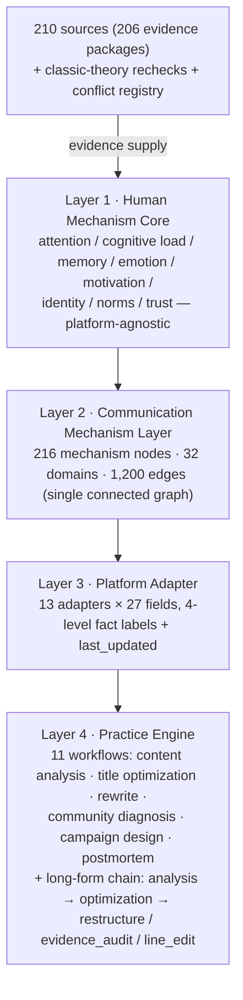

A request flows through the layers (e.g., "optimize this Xiaohongshu title"):
task detection → progressive disclosure (platform adapter + only the relevant mechanism nodes,
each with grade and boundary) → 11-step diagnostic engine → Recommendation Schema output:
diagnosis → core problem → why → fix → example → platform notes → next-step options.

## Evidence system

Every mechanism node carries an **Evidence Grade**; every recommendation must ship with the
grade and a boundary condition:

| Grade | Meaning | Usage rule |
|---|---|---|
| A | Strong: multiple independent teams / meta-analysis / high-quality replications | Core support for strong recommendations |
| B | Moderate: effect exists, boundaries matter | Main support allowed, boundary required |
| C | Emerging / contextual (mostly AI-era phenomena) | Must flag "young evidence" |
| D | Practitioner heuristic | Must label "experience, not empirical finding" |
| E | Contested / failed replication | Never supports a strong recommendation |

A replication-crisis watchlist is built in: ego depletion (E), behavioral semantic priming (E),
power posing (E), loss aversion (downgraded to B), nudge meta-effects (C), choice overload
(conditional), and the "8-second attention span" / "goldfish memory" media myths (rejected).

Current distribution: **82%** of nodes are A/B-grade (177/216); C-grade (30 nodes) concentrates in the
AI information environment module and is honestly labeled as fast-moving research.

## Quick start

```bash
git clone https://github.com/mizzlelover/muduo.git
```

The skill follows the **open Agent Skills standard** (`SKILL.md` entry point) and is natively
compatible with mainstream coding agents — drop the `muduo/` directory
into the matching skills folder:

| Environment | Global install (user-level, all projects) | Project-level install |
|---|---|---|
| Claude Code / ZCode | `~/.claude/skills/` (shared dir `~/.agents/skills/` also works) | `.claude/skills/` |
| Codex CLI | `~/.codex/skills/` | `.codex/skills/` |
| OpenCode | `~/.config/opencode/skills/` | `.opencode/skills/` |
| Trae | — | `.trae/skills/` |

```bash
# Example: install globally for all three environments at once
cp -R muduo ~/.claude/skills/
cp -R muduo ~/.codex/skills/
mkdir -p ~/.config/opencode/skills && cp -R muduo ~/.config/opencode/skills/
```

After installing, just talk to your agent in natural language (in Codex you can also invoke it
explicitly with `$muduo`).

**Fallback for other agents**: any environment implementing the Agent Skills standard can
reference this directory directly; agents that only read `AGENTS.md` work with a single line
added to their `AGENTS.md`:

```markdown
For communication diagnosis / content optimization / community growth / long-form editing /
postmortem tasks, read muduo/SKILL.md first and follow its workflows
and iron rules strictly.
```

Runtime dependencies: Python 3.9+ / PyYAML — only for the
`scripts/` engineering tools; conversational use is dependency-free.

Then just talk to your agent:

```text
Why does this Xiaohongshu title get no clicks?
Mechanism-level analysis: why doesn't this WeChat article get shared?
Our paid community has 800 members and only 20 talk. How do we fix it?
Optimize this 6,000-word industry report (long-form mode).
Postmortem: 500K impressions, 4% CTR, 8% saves, 0.3% shares — where is the leak?
```

## Evaluation

Honesty first: in the **self-eval**, the evaluator and the knowledge base share a lineage, so
scores carry a hindsight ceiling — they prove the library *can support* qualified answers, not
that a blind model will produce them. That's why an environment-isolated blind test was added,
with the protocol and all score trails public.

| Evaluation | Scale | Result |
|---|---|---|
| Self-eval | 160 cases (110 base + 50 long-form) | 160/160 pass, 0 red lines; base mean 17.71/18, long-form 17.94/18 |
| Isolated blind test | 32 stratified cases ×3 rounds + 48 E2 cases (answers blind · independent scoring · audit sampling) | all pass, 0 red lines |
| Long-form live run | 5,000-word demo article with 15 planted defects | 15/15 detected |

Rubric: 9 dimensions × 0–2, plus two red lines (overclaiming / ethical_safety — a zero on
either fails the whole case). Known limitations: training-data homogeneity in the blind test
(the clean fix is an external independent model), and an external blind run over the full
208-case library is pending (protocol ready: `evals/blind_protocol.md`) — see [EVALS.md](muduo/EVALS.md).

## Repository map

```text
muduo/
├── SKILL.md            # Agent entry: task detection + progressive disclosure + 11 iron rules
├── knowledge/          # 216 mechanism nodes (32 domains) · 210 sources (206 evidence packages) · conflicts · rechecks · cases · anti-patterns
├── platforms/          # 13 platform adapters (27 required fields + fact labels + last_updated)
├── workflows/          # 11 workflows (6 base + 5 long-form)
├── schemas/            # 8 data schemas (mechanism node / source / case / platform adapter / long-form…)
├── evals/              # 208 benchmark cases + rubric + blind protocol & score trails
├── scripts/            # 13 automation tools
└── ARCHITECTURE.md · METHODOLOGY.md · EVIDENCE.md · PLATFORM_ADAPTER.md · EVALS.md
    · CONTRIBUTING.md · INDEX.md
```

| Component | Count |
|---|---|
| Mechanism nodes | 216 across 32 domains, 20+ fields each (definition / causal chain / variables / evidence / boundaries / failure conditions / ethical risks) |
| Mechanism graph | 1,200 edges · fully connected · mean degree 11.1 |
| Sources | 210 registered (206 active evidence packages + 4 merge tombstones), 100% cited by nodes |
| Platform adapters | 13 × 27 fields · 291 platform facts (46 official_rule / 9 verified / 233 consensus / 3 speculation) |
| Anti-patterns | 29 (10 general + 19 long-form/AI-writing, each with short-term why-it-works and long-term why-it-hurts) |
| Evals | 208 cases (45 easy / 104 medium / 59 hard, incl. adversarial, E2 and regression sets) |

## Roadmap

- [ ] Full 208-case third-party blind test run by an external independent model (protocol ready: `evals/blind_protocol.md`)
- [ ] Online refresh of platform adapters (`update_platform_knowledge`)
- [ ] Evidence upgrade for C-grade nodes (meta-analysis retrieval for the AI module)
- [ ] Node-ify audience theory (uses_and_gratifications); Chinese-context empirical retrieval
- [ ] End-to-end few-shot demos for high-frequency scenarios (title / community diagnosis)

## Author · About 谁是专家 ("Who Is the Expert")

This methodology was researched and built by **谁是专家** — starting from 100 canonical books
and primary literature, refusing one-summary-per-book distillation in favor of cross-source,
mechanism-level knowledge engineering with evidence awareness and ethical boundaries throughout.

The same name runs as a creator IP on three platforms, sharing communication science,
community growth, and knowledge work in the AI era:

- **Xiaohongshu / RED**: [谁是专家](https://www.xiaohongshu.com/user/profile/64dd6c680000000001011d25) (RED ID: **9945310245**)
- **WeChat Official Account**: 谁是专家 — scan the QR code below (or search "谁是专家" in WeChat)
- **X (Twitter)**: [@dboy_yi2025](https://x.com/dboy_yi2025)

<div align="center">
  
  <p><sub>Scan to follow on WeChat · 微信扫码关注</sub></p>
</div>

## Citation

```bibtex
@software{muduo,
  title  = {Human Communication \& Community Growth Engine (人类传播与社群增长引擎)},
  author = {谁是专家},
  year   = {2026},
  url    = {https://github.com/mizzlelover/muduo},
  note   = {v1.0 · 216 mechanism nodes · evidence-aware communication methodology skill}
}
```

## License

- **Code** (Python tools in `scripts/`): [MIT](LICENSE)
- **Knowledge base & methodology docs** (knowledge / platforms / workflows / evals / all .md):
  [CC BY 4.0](https://creativecommons.org/licenses/by/4.0/) — attribution to 谁是专家 with a
  link to this repository.
